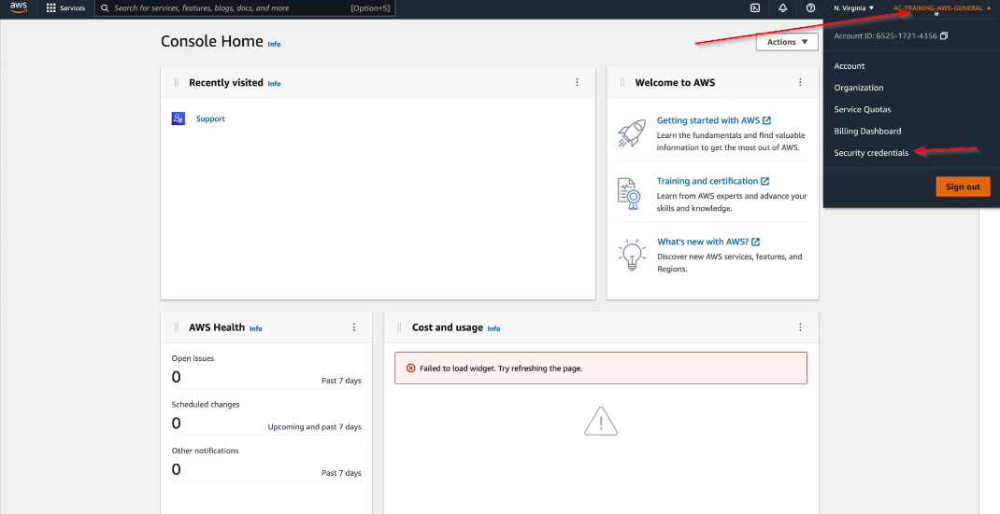
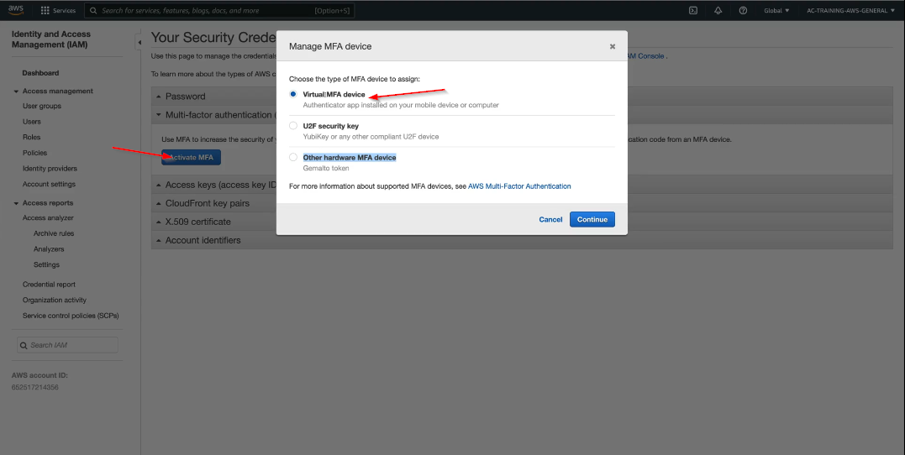
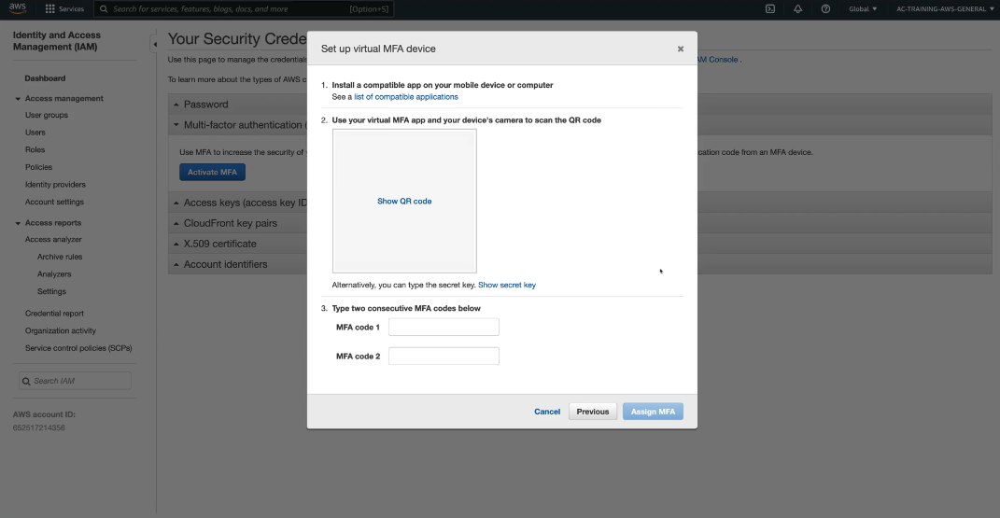

## Lab: Securing AWS Account MFA

We are going to activate MFA for an AWS account.

### Steps:

1- Open AWS Management console
2- Click the user menu dropdown and click Security Credientials
 
3- Activate MFA and Select Virtual MFA device option

4- Install the Google Authenticator on your mobile
5- Then Scan the QR code by using the google authenticator app
