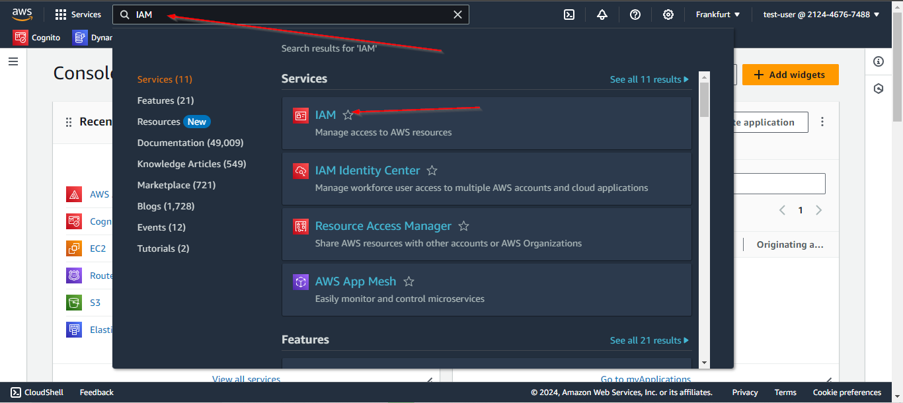
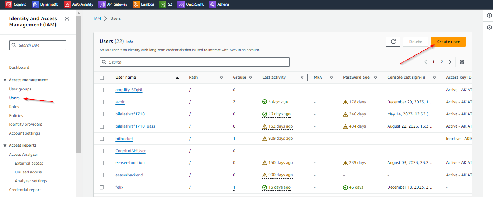
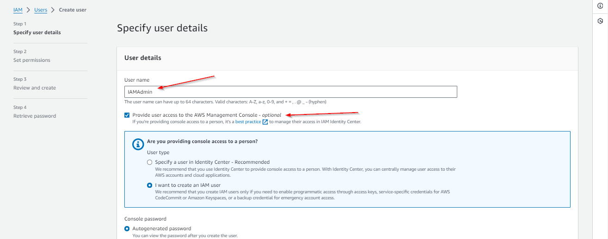
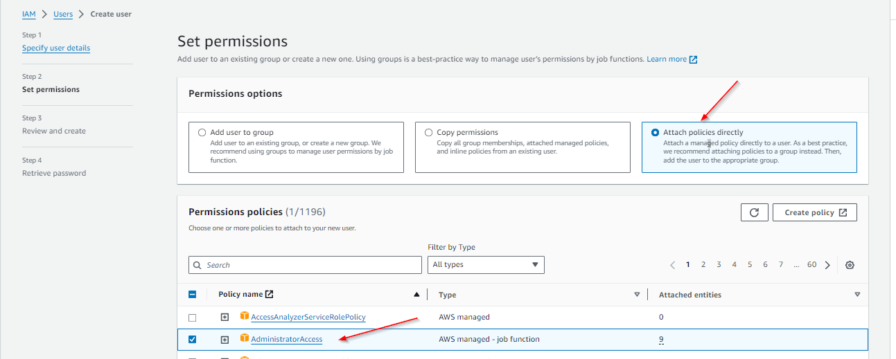
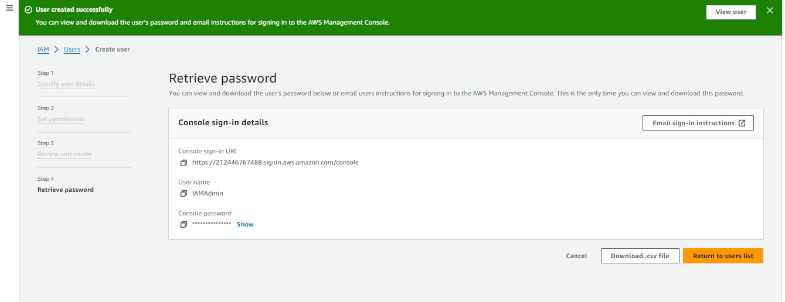

## Lab 2: Create a new identity and give administrator permission to it

For this, we will use IAM service to create new identity within our account.

## Steps:

1- Open a management console and search for IAM service. Click on it to open IAM dashboard page.

2- Click users item from the right panel and create click create user button to create a new user

3- Add the username in the input box. Select management console access option if you want to give this user access to AWS Management console.

4- Select the Custom password option. If you want the user to reset the password at the very first login, then select the password reset option.

5- Now, Attach admin permission to this identity

6- Review and create user
