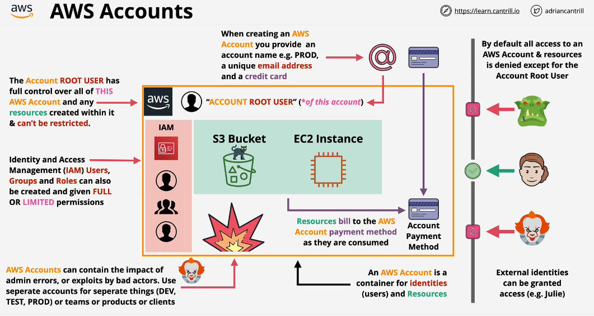
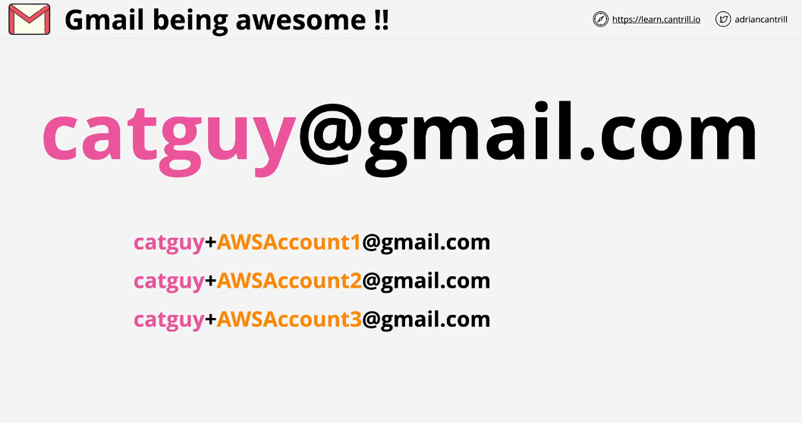
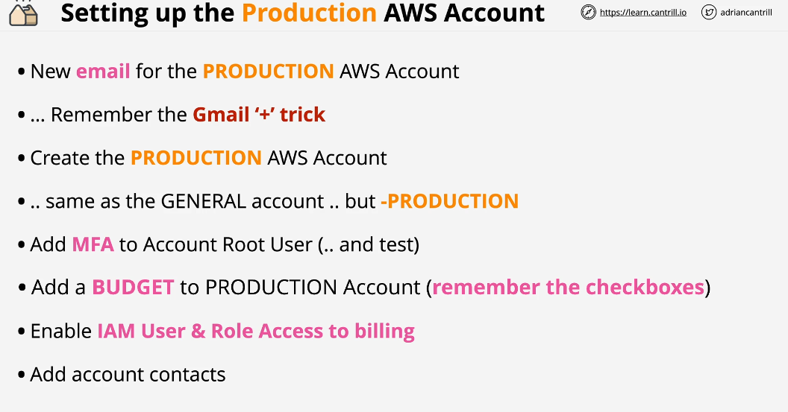

## AWS Accounts

Really, Understanding what is AWS account and what benefits it provides is one of the most important concept in AWS

AWS Account is a container for identities (users) and resources. Identities, techinically, is a correct way to referring to users.

### Account Root User

When you create a AWS account, the only identity or user created within that account is known as Account Root user. The account user has full access over that AWS Account and it cannot be restricted.

### Important Steps to create new Account
