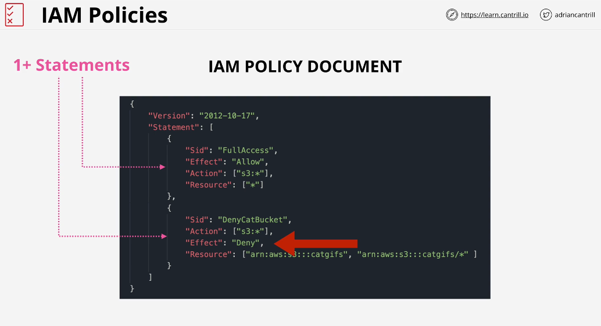
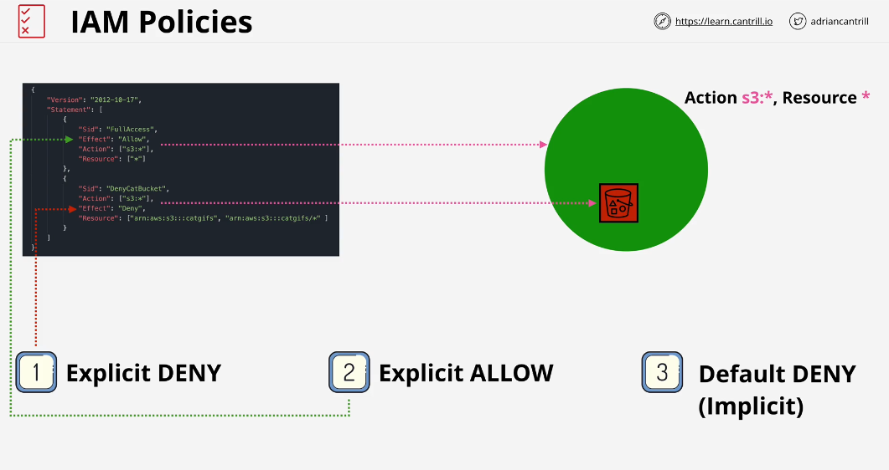

## Identity Policies

IAM policy is just set of security statments. It allows and denys access to AWS services to identity which uses this policy.

The statment only applies if the interaction you are having with aws match the action and resource.

### Policy Types
1- Inline Policy
2- Managed Policy (AWS and Customer Managed)