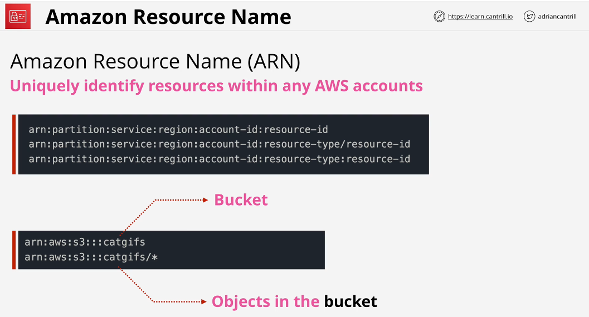

## IAM User

IAM starts with principle. This is a word repsents identity trying to access AWS. Principle can be individual people, computers etc. For principle to do anything, it needs to be authenticate and be authorised.

