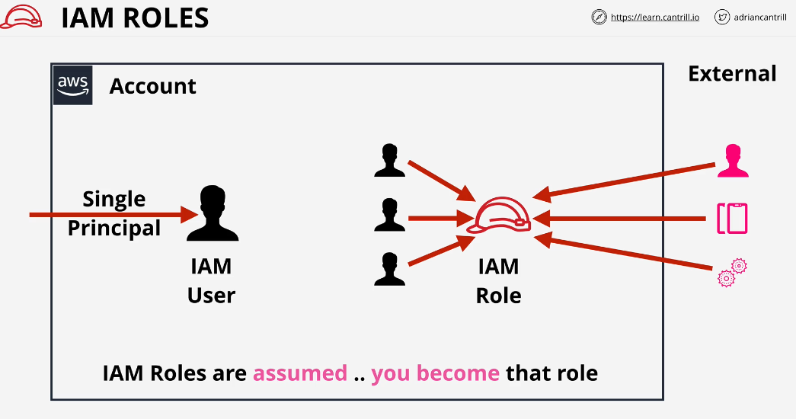
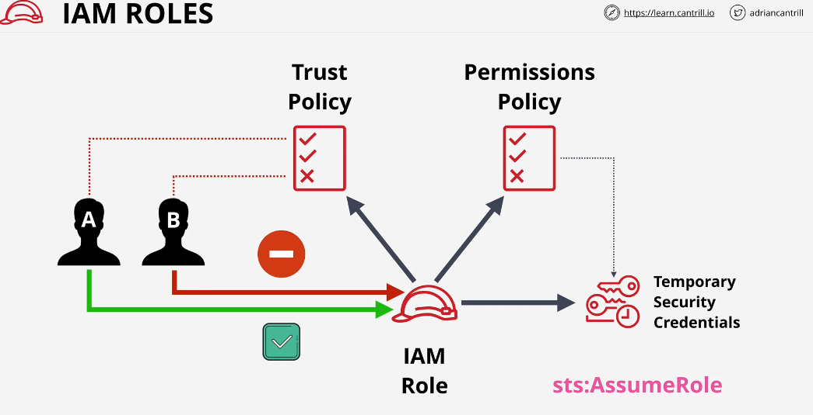
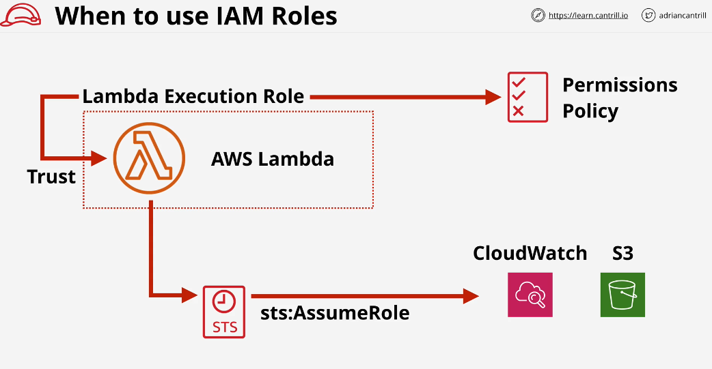
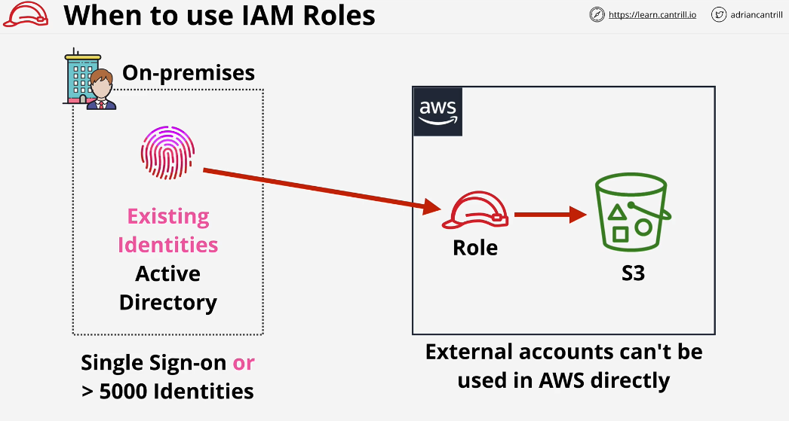
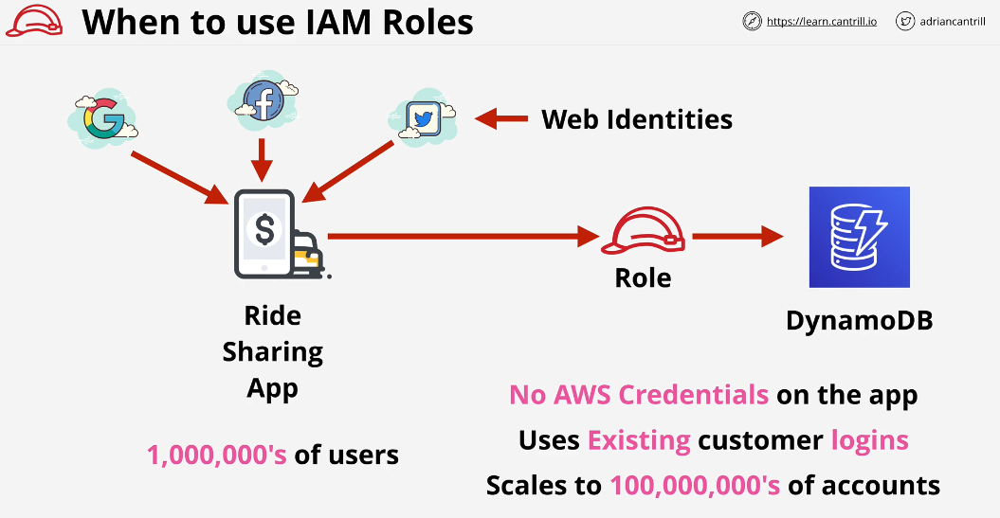
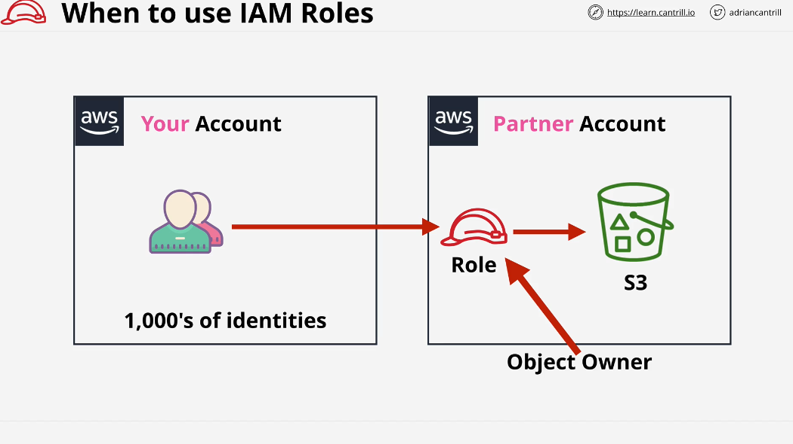

## IAM Role

If you cannot identify the number of principles which use an IAM identity, then, it can be perfect candidate for IAM Role.

Roles are often used when you need to reuse existing identities such as Active directory identites.

