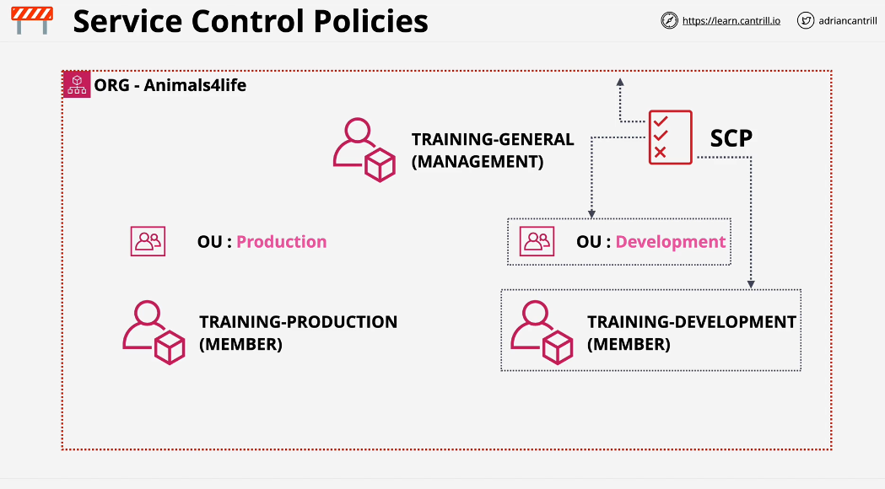
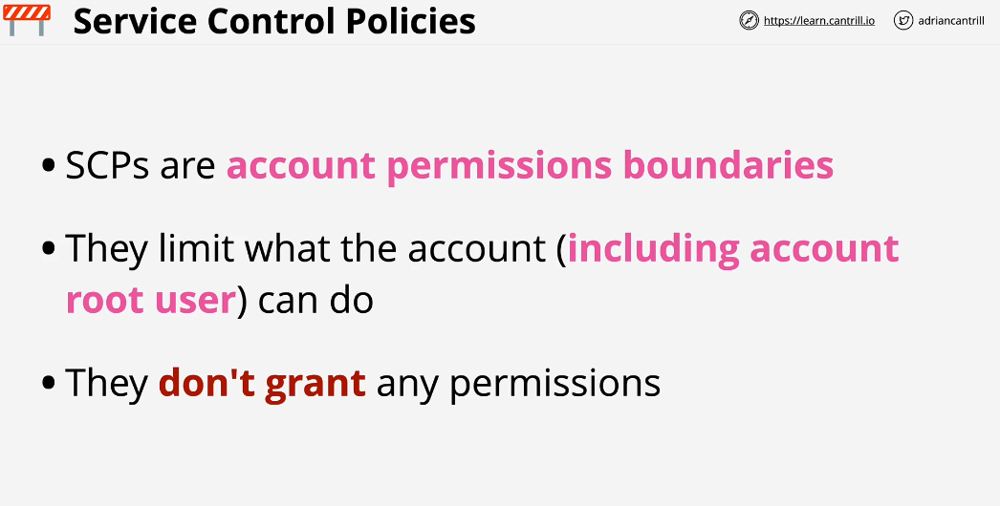
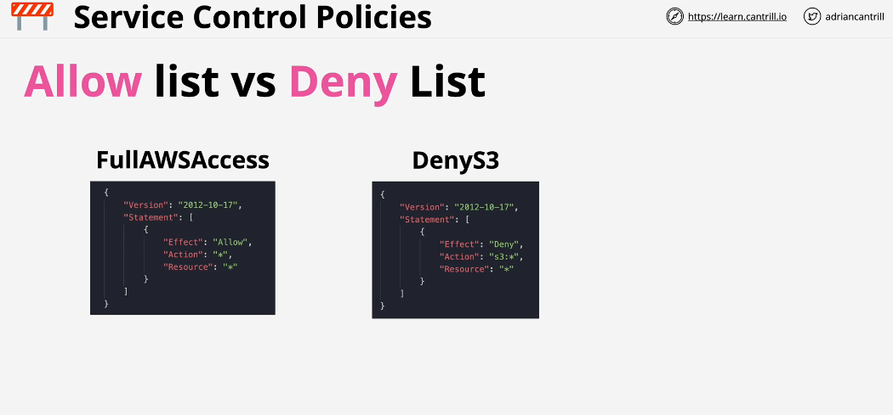
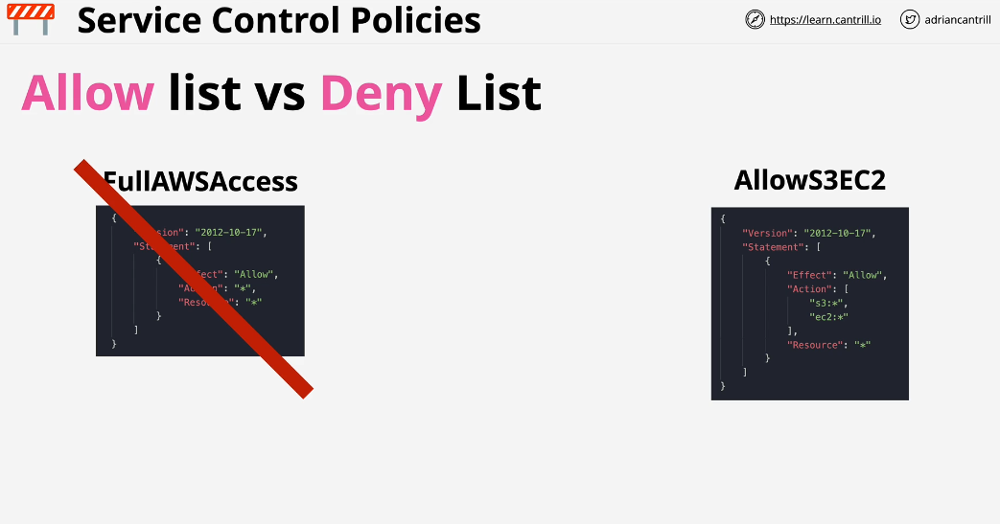
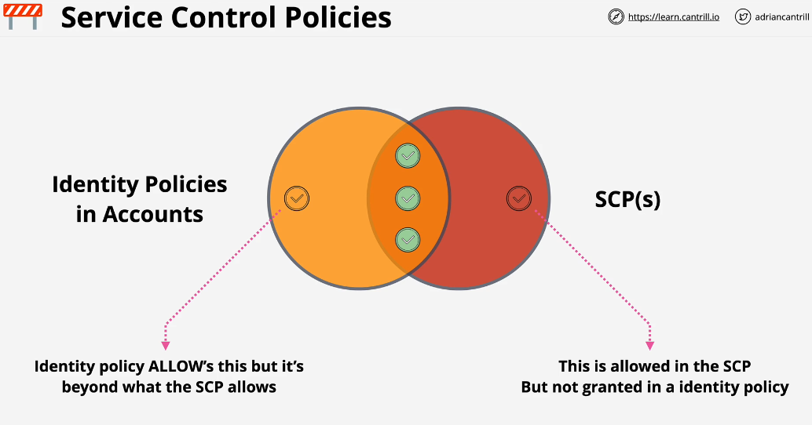
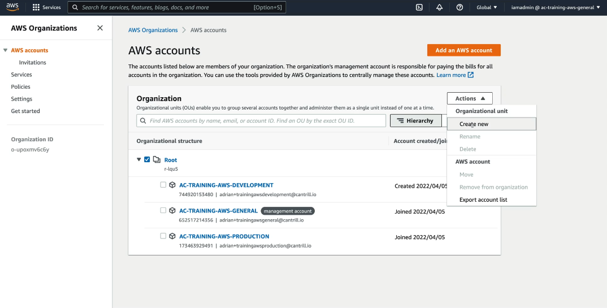
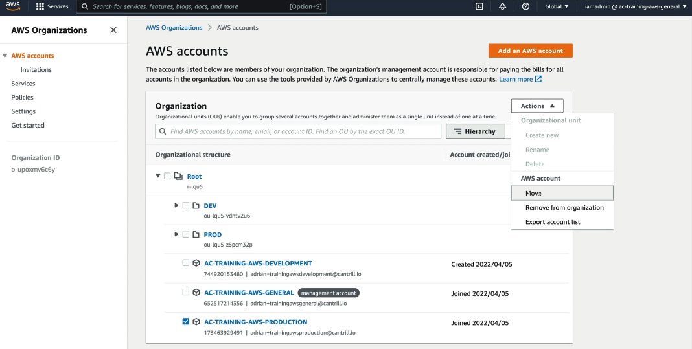

## Service Control Policies

The service control policy is a json document. These service control policies can be attached to an organization as a whole by attaching them to root container. or they can be attached on or more organizational units or they can event be attached to individual account.

if you have service controle policies attached to management account, The management account of an organization is never affected by SCP's. As an securiy Best Practice, becuse the management account be restricted using SCP's, we should avoid using management account for any AWS resources.

Service control policies don't grant permissions. They only limit what the identities within that account can or can't do.

## Deny List

## Allow List Architecture

Add account to respective OU

