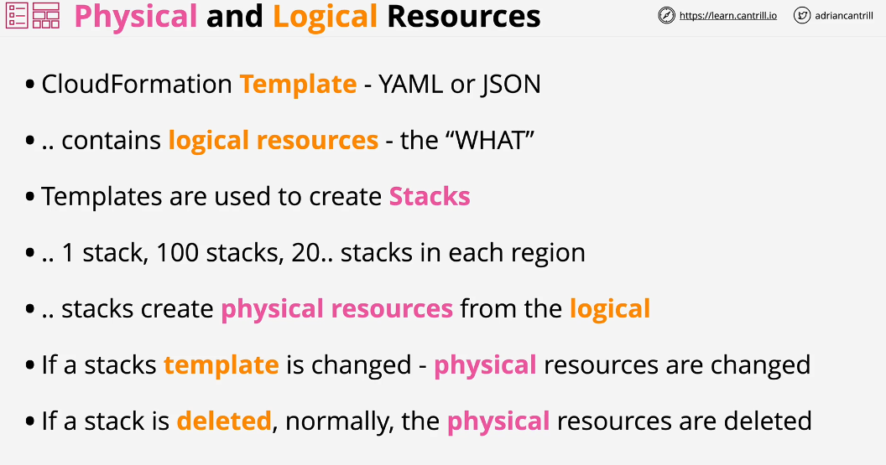
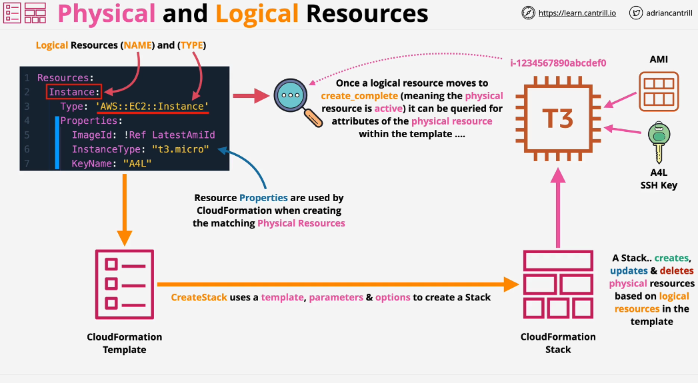
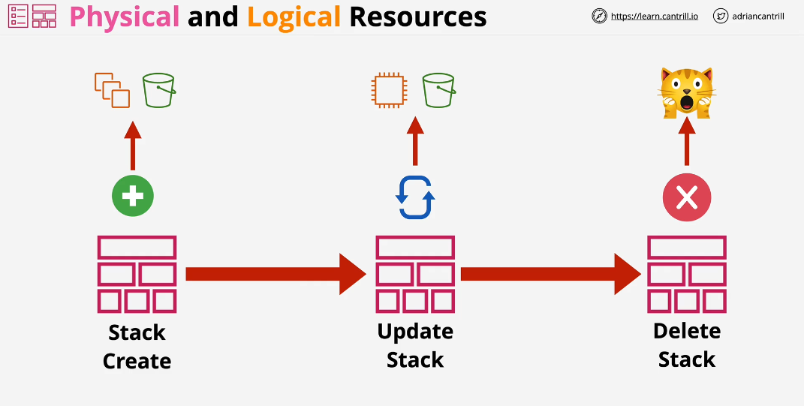

## CloudFormation Physical and Logical Resources

The Job of a stack is to create physical resources based on the logical resources.
If stack template is updated in some way or stack itself is updated, the physical resources are also changed.

Cloudformation lets you automate infrastructure.
Cloudformation can also be used as part of change management. you can store templates in source code respository, add changes and get an approval before applying.