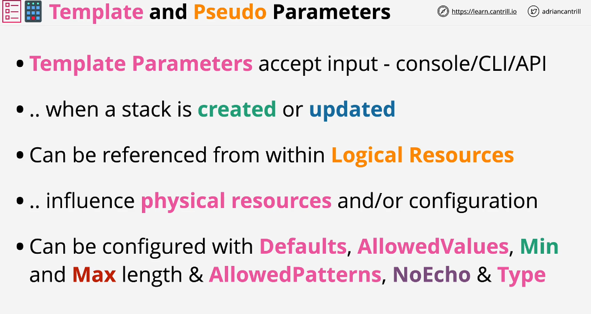
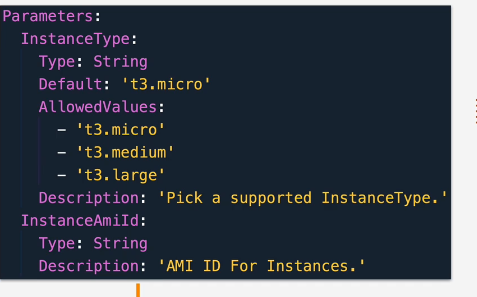
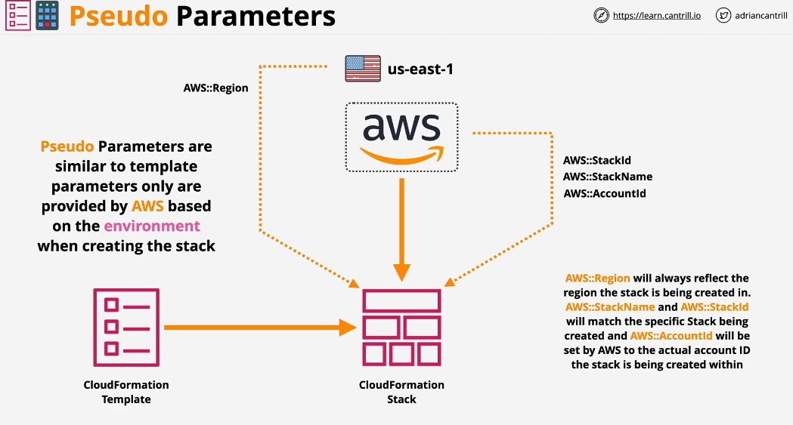

## Template and Pseudo Parameters

Parameters allow inputs. They let external sources to provide inputs into cloudformation.
The values for those paramters can be referenced within logical resources.

