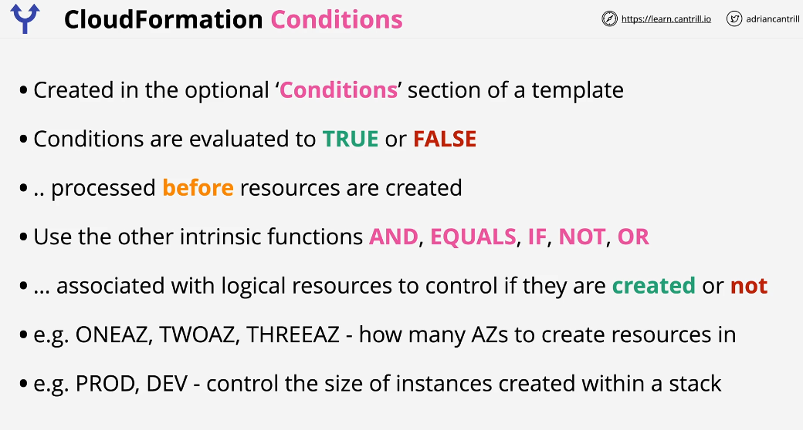
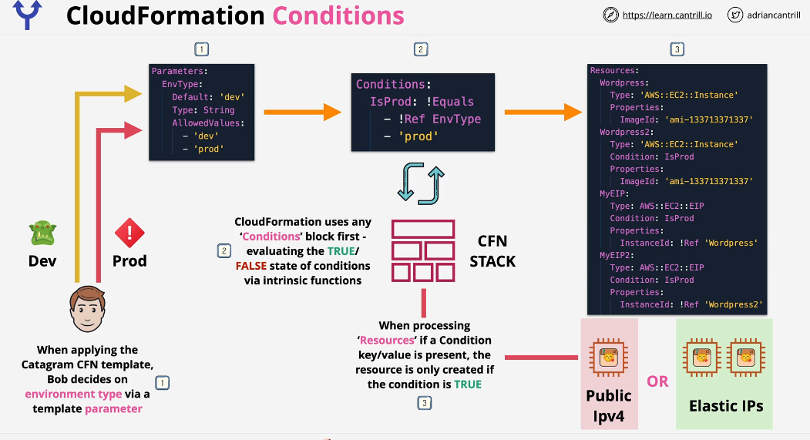

## Cloudformation Conditions

Conditions allow stack to react certain conditions and change infastructure which is being deployed or change configuration of that infrastructure based on these conditions.

