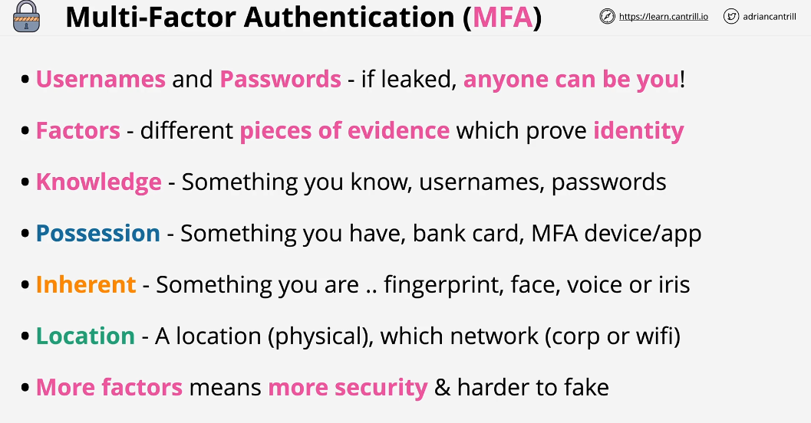
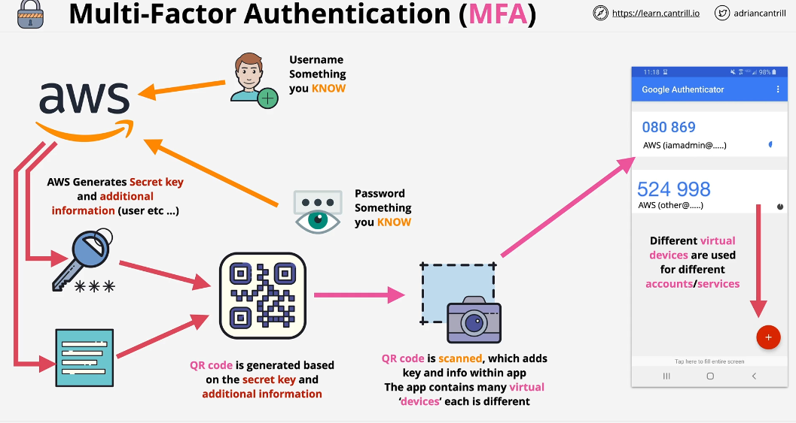

## Multifactor Authentication (MFA)

A Factor is a piece of evidence which proves identity. We can use different types of factors to improve security of our account.

- Four Types of Factors

1- Something you know (Username and password)
2- Something you have (Bank card, MFA Device/app)
3- Something you are (Face, fingerprint, voice)
4- Location

