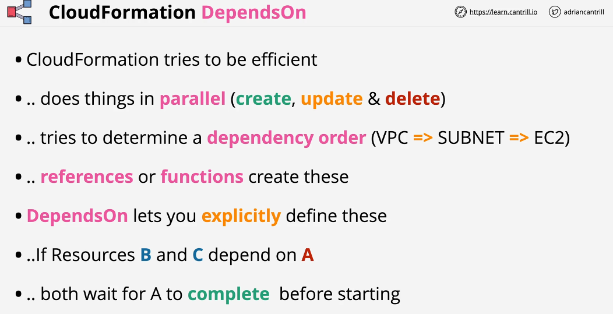

## Cloudformation Dependens On

## Cloudformation WaitCondition, Creation Policy and cfn-signal

## CloudFormation Nested Stacks

Designing cloudformation stack in a way where everything is contained in a single stack is fine as long as you don't hit any of the limit that might impact your projects. There might be few things we need to consider.

1- 500 Resources per stack
2- Can't reuse stack resources (such as VPC)

Stack is isolated by design. You can use Ref function to reference resources from other resources within the same stack But you can't use this (Ref) to reference resources in other stack.

