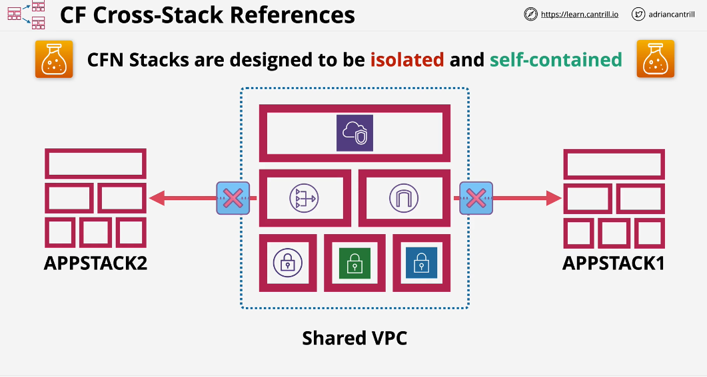
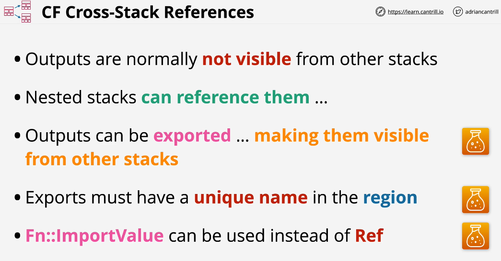
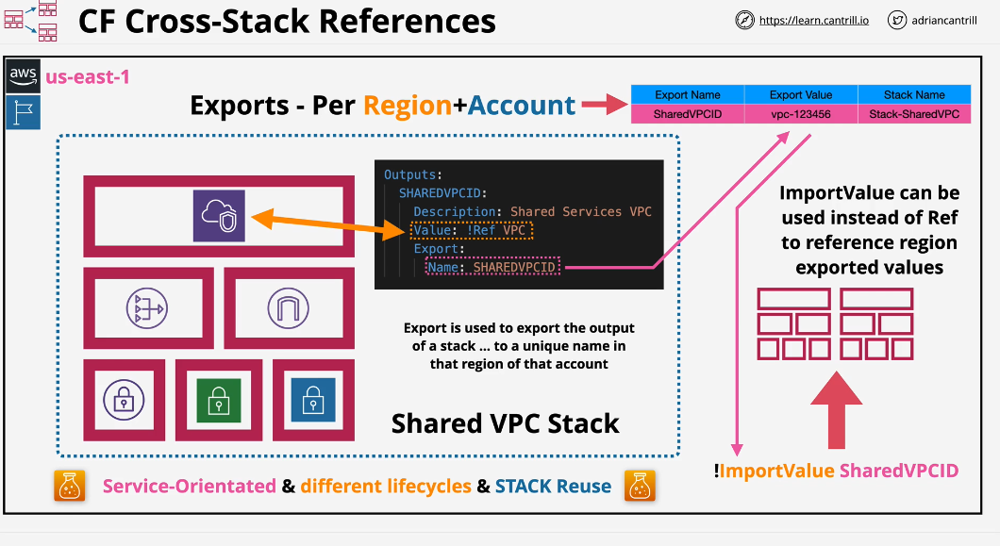
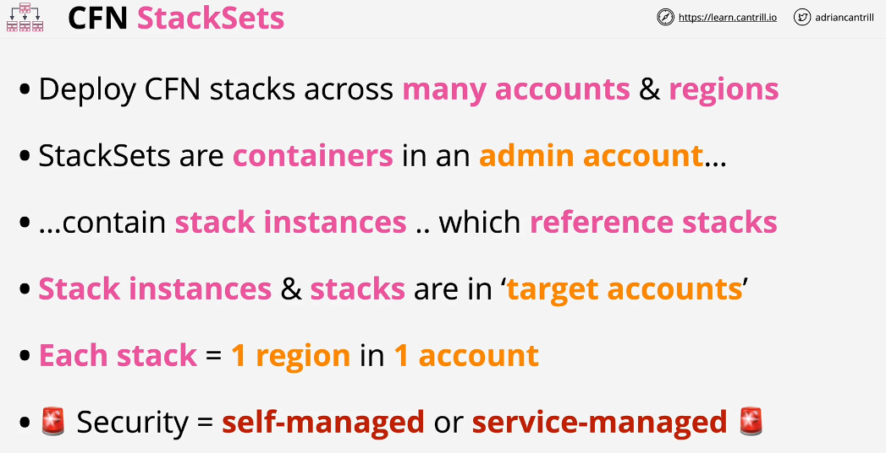
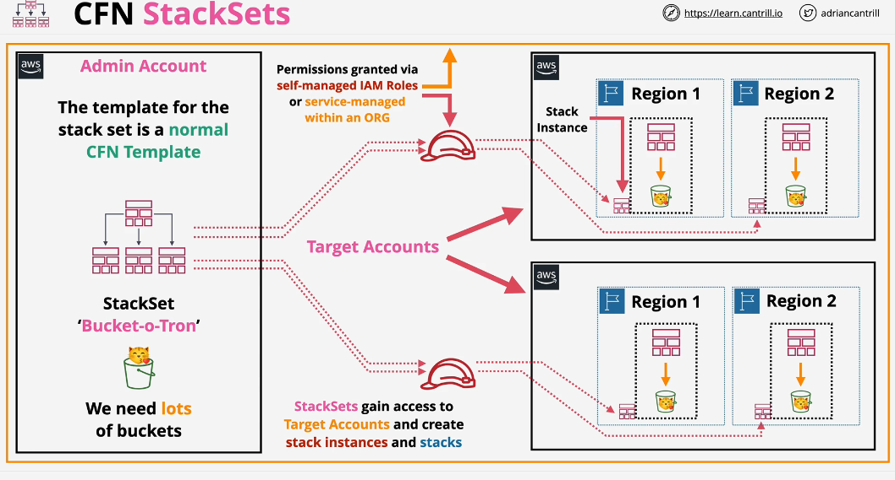
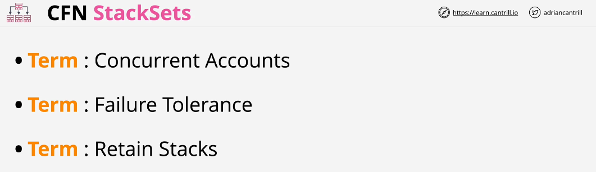
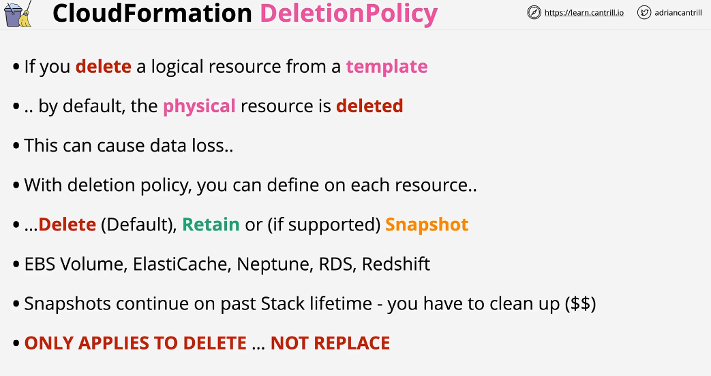
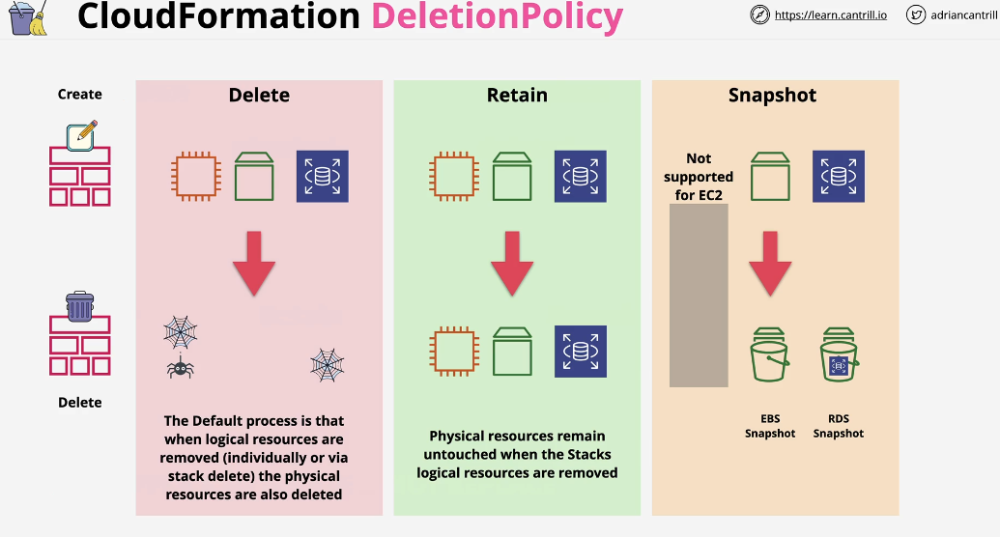
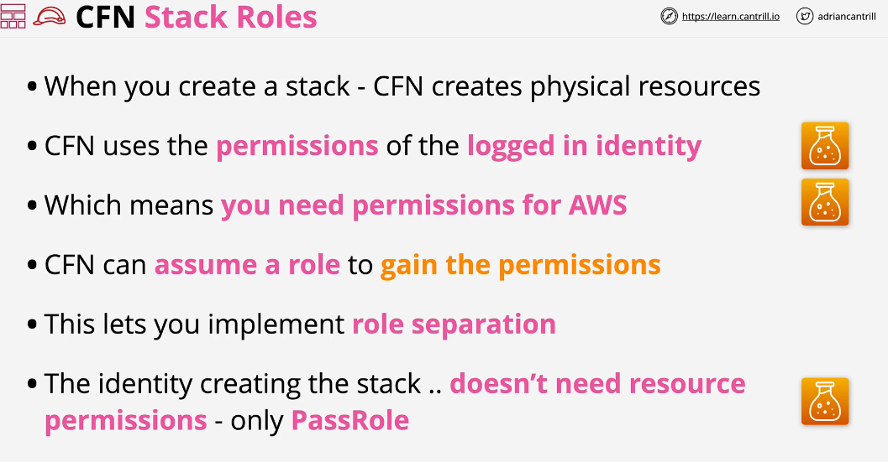
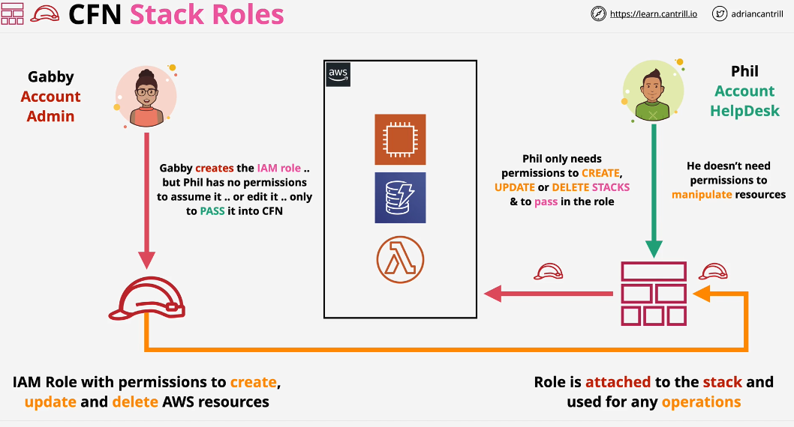

## Cross-Stack References

if you are deploying EC2 in appstack 1 and appstack 2, they couldn't natively reference subnets created by the shared VPC. 

## StackSets

Stackset is a feature of cloudformation which allows us to craete, update and delete infrastructure across many regions or many accounts.

Concurrent Account: How many AWS Accounts can be used at the same time? The more concurrent accounts that you define the faster the resources will be deployed as part of stacksets.

Failure Tolerance: Failure tolerance is amount of individual deployments which can fail before the stackset itself is viewed as failed.

Retail Stack: By default, the stack instance will be deleted when you delete stackset. if you want to retain those stack instance within the target accounts, you can define it.

## CloudFormation Deletion Policy

if you delete a logical resource from within a temaplate, apply that template to an existing stack or if you delete a stack entirely, the default behaviour of cloudformation is to delete corresponding physical resource.

## CloudFormation Stack Roles:

By default, the cloudformation uses the permissions of an identity who is creating the stack. Stack roles allow you to assume role tol gain permissions to create resources without having to have permissions to interact with AWS services.

