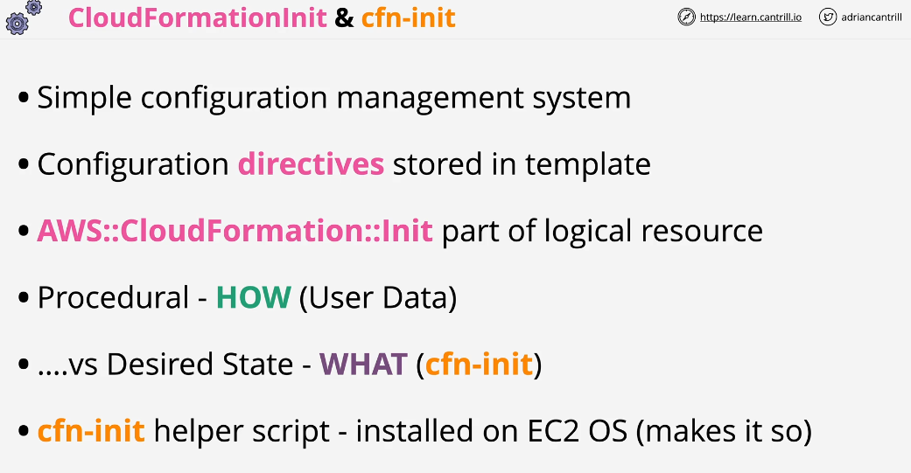

## AWS CloudFormation Init && cfn-init

cfn-init helper script is a program running on ec2 to fetch configuration directive from ec2 logical resource define in the template and apply those configuration in the instance.

