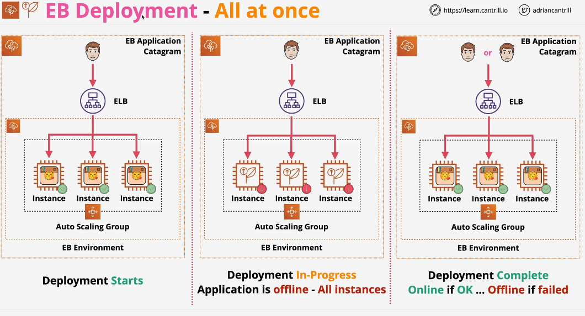
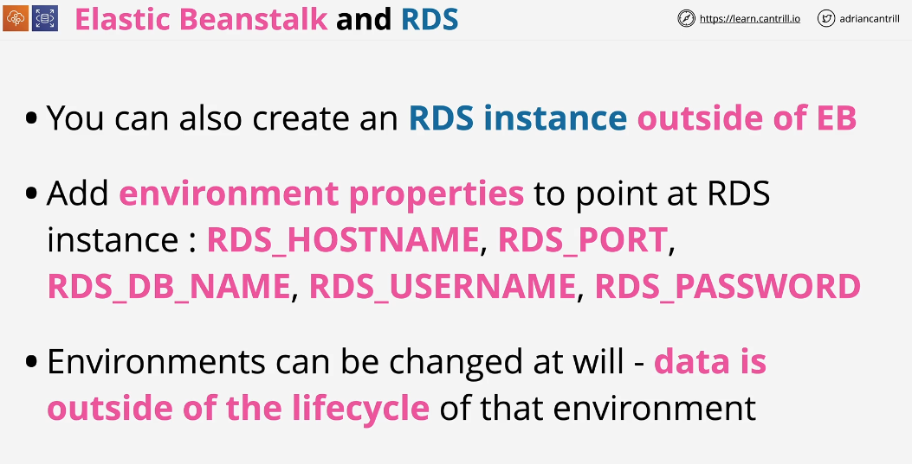

## Elastic Beanstalk

EB is a platform as a service product within AWS. The Platform as a service is a type of service where vendor of the product handles all of the infrastructure. You only provides the code which is executed by vendor.

The user of the service provides code and EB handles environment to run that code.

When you create an environment within EB Application, you have to specify environment tiers. The options for this are web server tier and worker tier.

## Elastic Deployment Policies

All at once = New Application version is deployed onto instances within the elastic beanstalk at once. It causes outage.

## Elastic Beanstalk Lifecyle and RDS

If you want to use database service RDS within your Elastic Beanstalk Environment, you have two options 

1- You can create RDS Instance within environment. It is linked specifically to that environment.

2- Create RDS Instance outside of EB Environment.

## Decouple Existing RDS within EB from EB Environment

