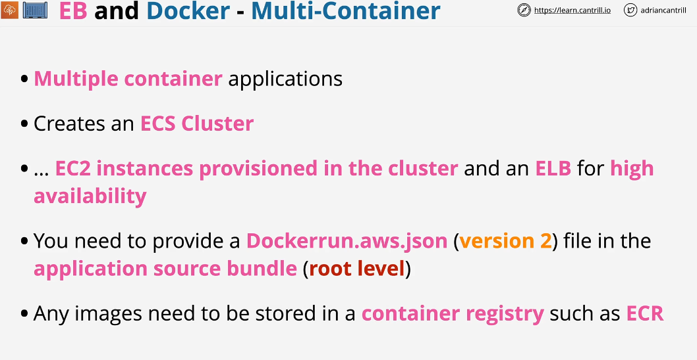

## Ebextensions

Elastic beanstalk is based on the cloudformation to create environments and resources within those enbironments. You can .ebextensions folder to add new resources within EB environments.

## Enable HTTPS

## Environment Cloning

#### Why clone environments?

1- Clone Production environment into Test Environment for testing
2- Clone environment to check compatbility of an application with new version of platform. 

## EB and Docker

Multi container = Multiple containers per instance

MultiContainer = Elastic Beanstalk takes care of Amazon ECS tasks including cluster creation, task definition and task execution.

