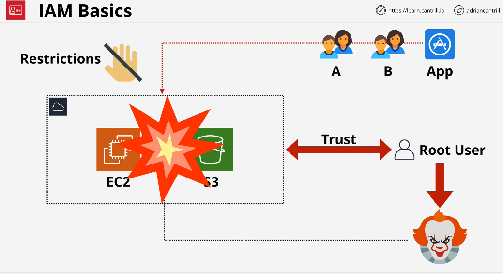
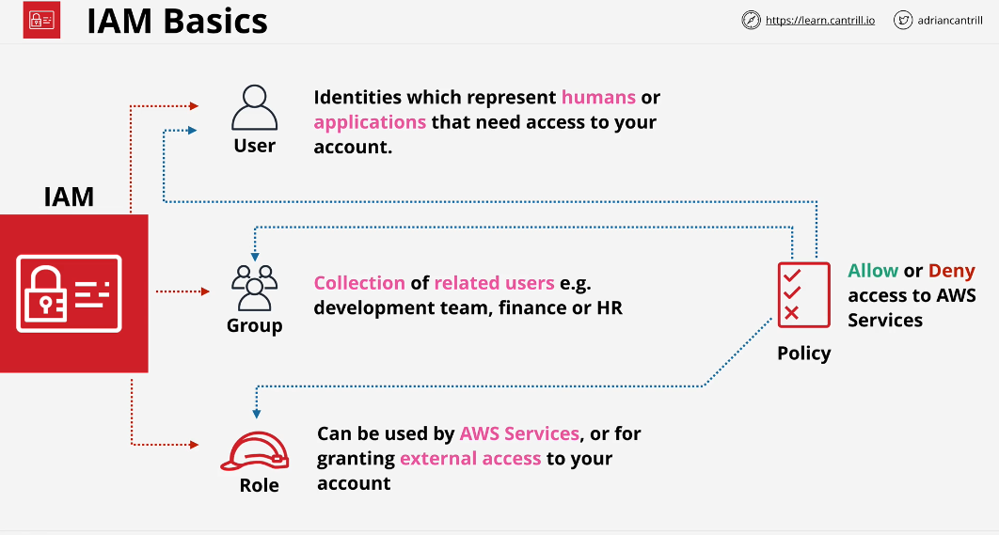
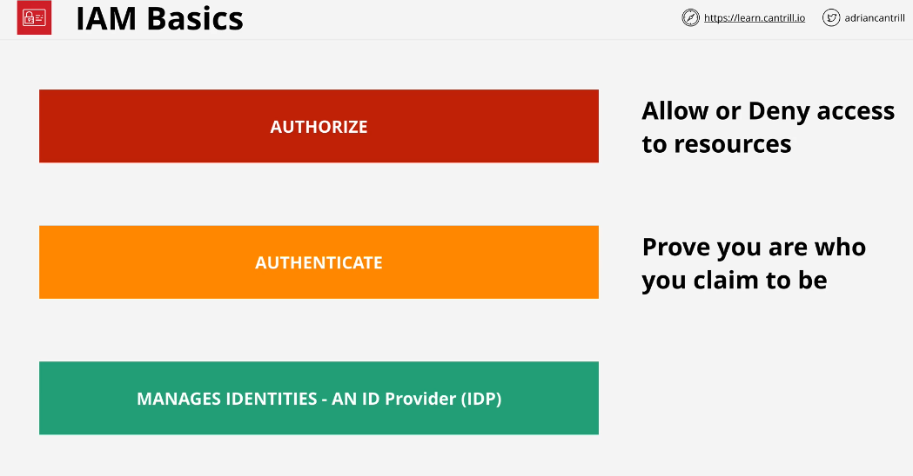
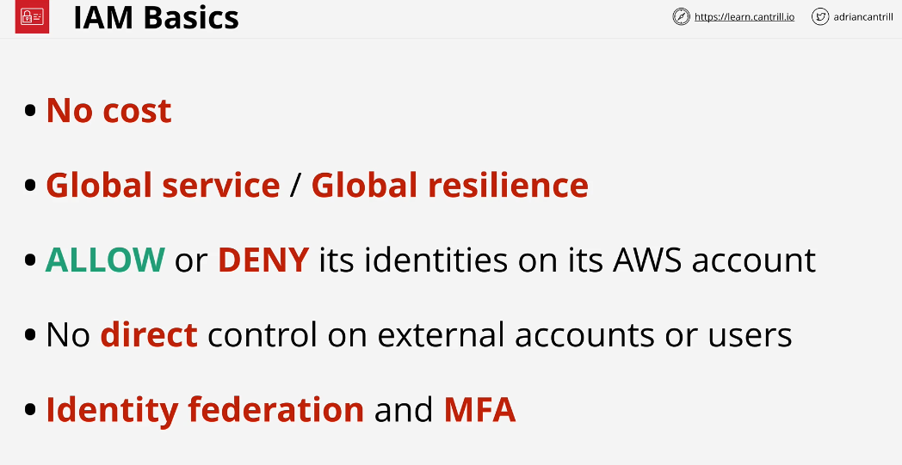

## IAM Basics

Why IAM exists?

As you know by now, When you create an AWS account, the root user gets created along with an account and it cannot be restricted. Don't use root user to create resources. We can create multiple identities to allow others memebers of our organization to perform their tasks. To create other identities, we need IAM service to manage those identities and grant permissions to those identities.

### IAM has three Jobs

### Important Points

