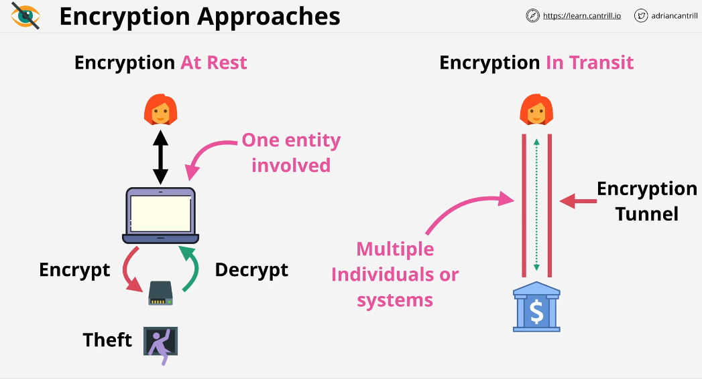
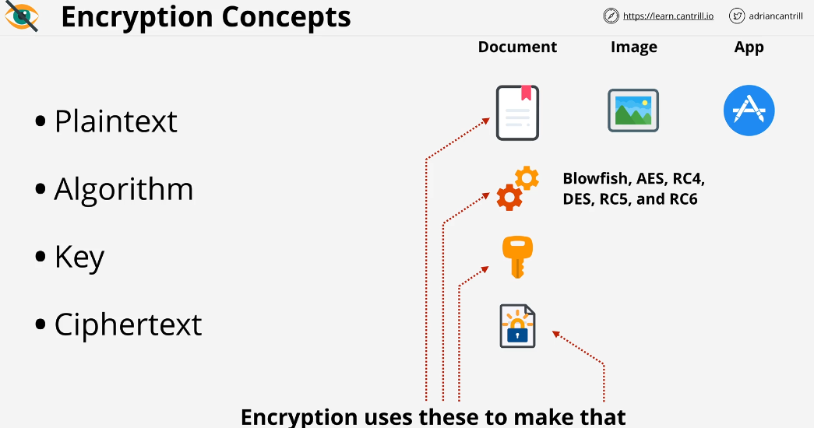
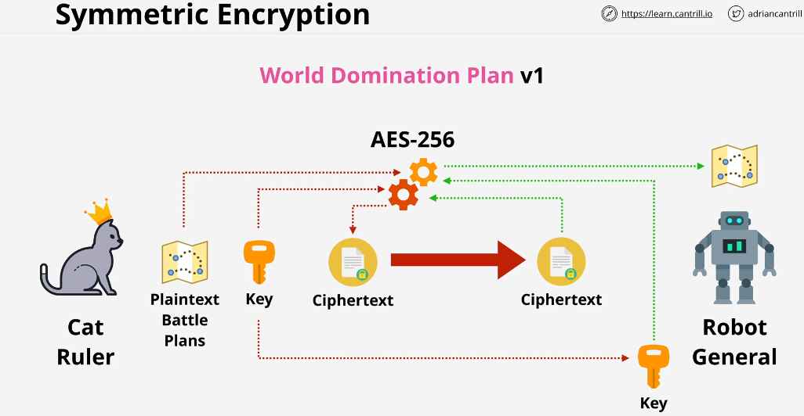
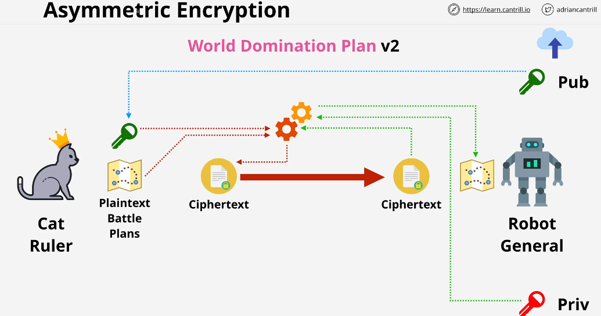
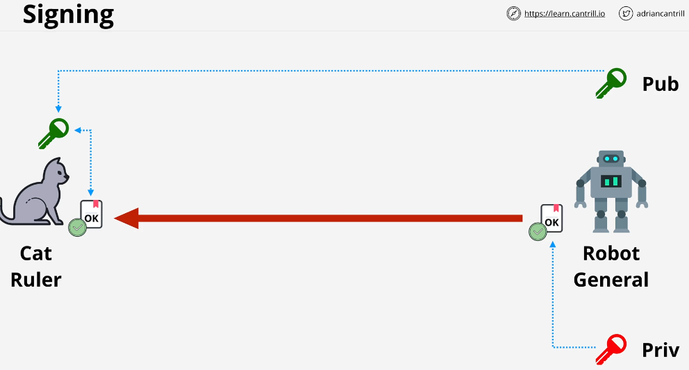

## Encryption 101

### Encryption Approaches

### Symmetric Encryption
The same key is used for both encryption and decryption processes.

The Symmetric encryption is only used for disk encryption, local file encryption etc.

### Asymmetric Encryption

### Signing
