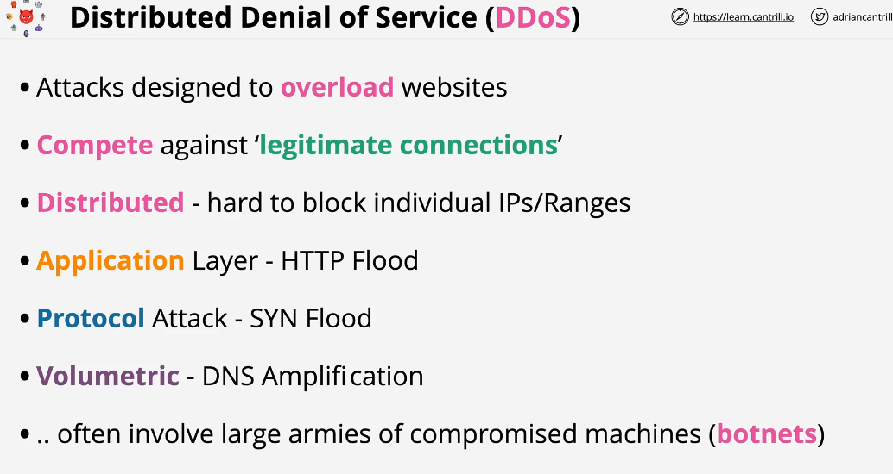
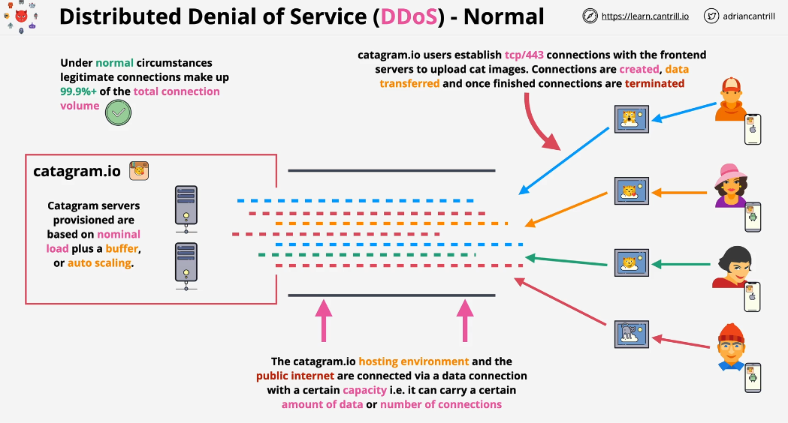
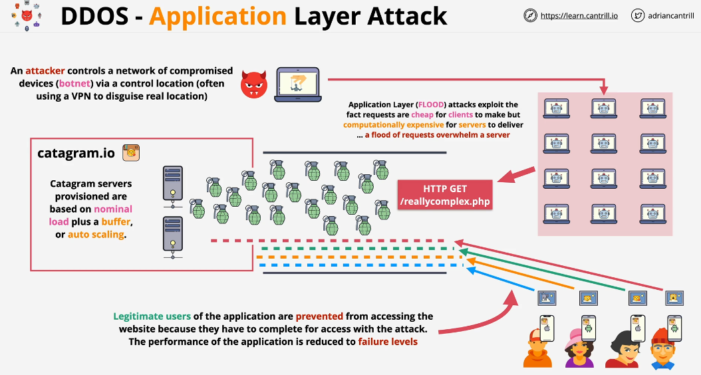
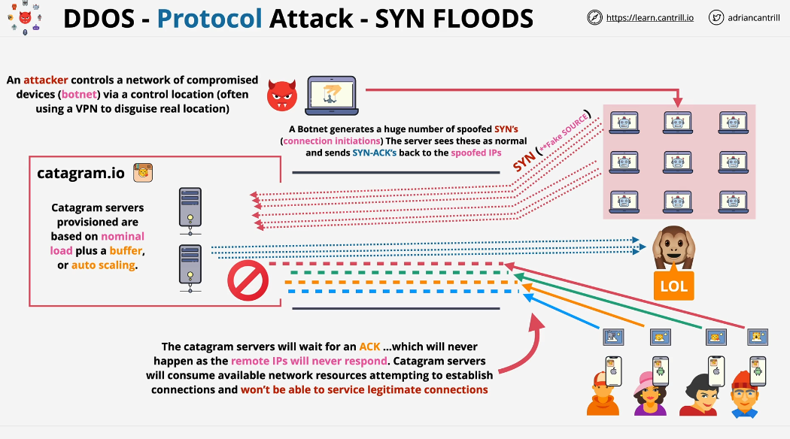
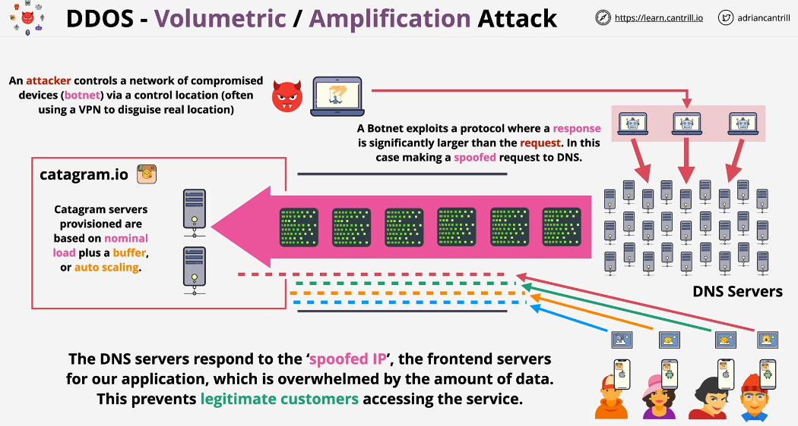

## DDoS Attack

This attack is designed to overload websites or compete the legitimate connections.

### Without DDoS

A attacker who is controlling a network of compromised machines known as botnets. These machines are distributed globally. In most circumstances, the owner of these machines have no idea that they have been compromised.

