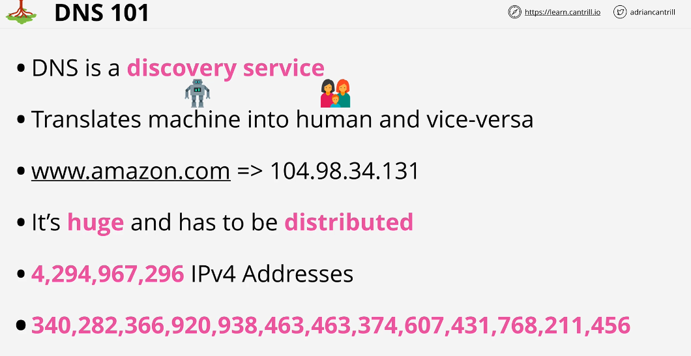
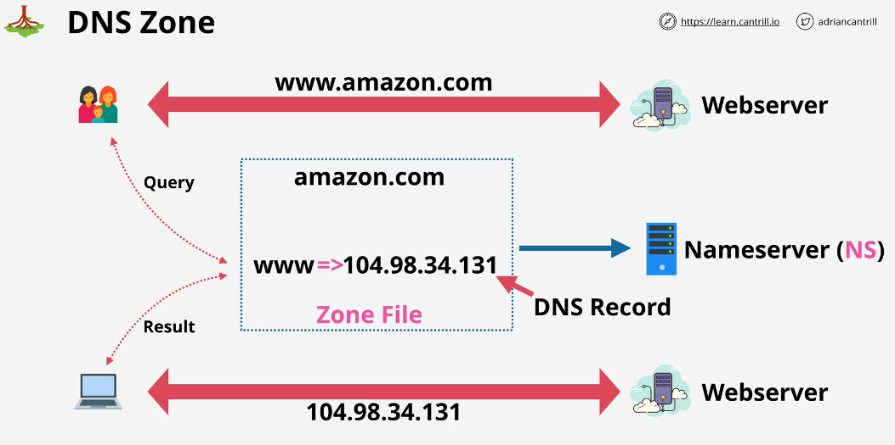
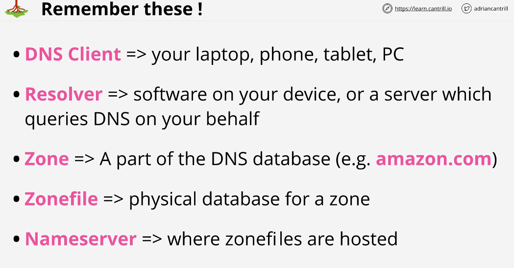
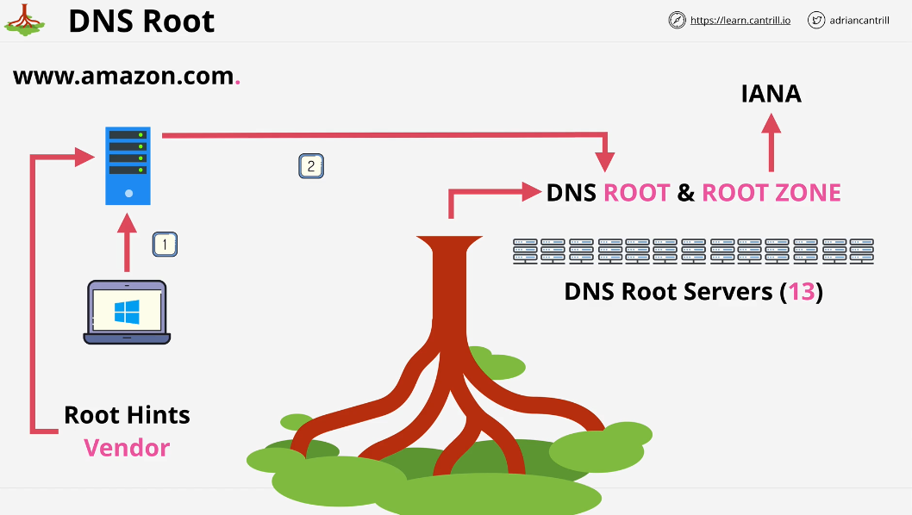
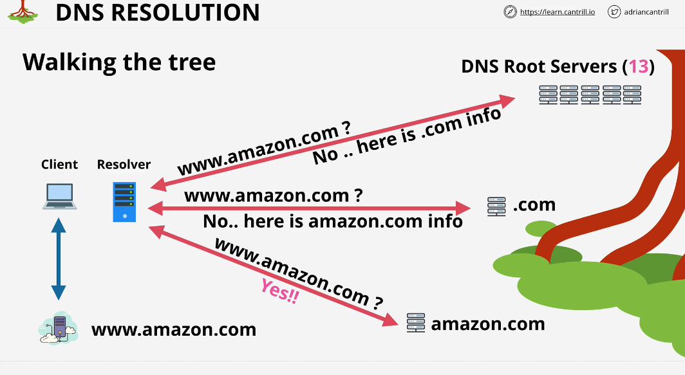
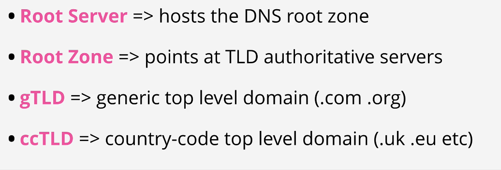

## DNS 101

The job of a DNS is to find IP address for given domain name.

One of the core pieces of functionality that DNS provides is it allows DNS resolver server, which is sitting in your internet router or in your internet provider, to find that zone(amazon.com), once you locate that zone, we can query it and get the result and use that result to access the website.

### DNS client:
DNS client refers to device or things which wants the data that DNS has.

DNS client talks to DNS resolver and it asks DNS resolver to query DNS on its behalf.

### DNS Root:

DNS Root or Root Zone Database is a list of top level domains. In other words, it is a collection of delegations.

### DNS Resolution:

