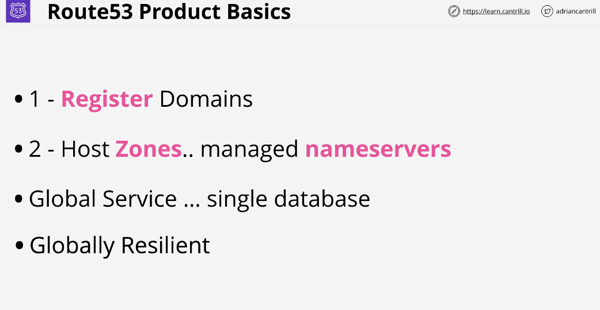
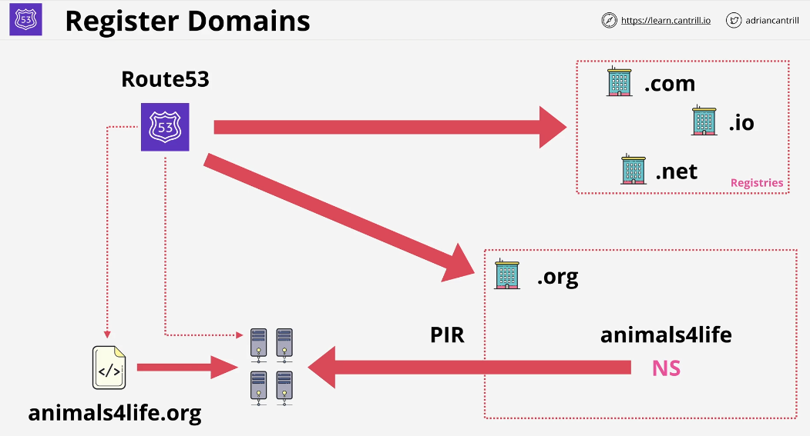
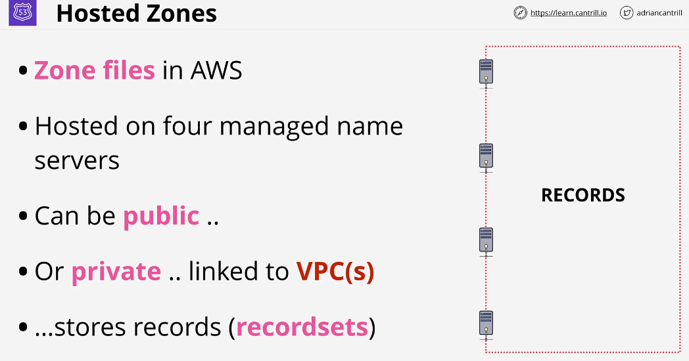

## Route53

Globally Resillient (data is replicated between regions. it can tolerate failure from one or more region.)

### Registries: 
These are companies who manage the top level domain. They have been deligated this ability from IANA who itself manage the Root Zone.

As part of registering the domain, in our case we are registering .org domain, Route53 adds four Nameservers records in the .org registery zone.

